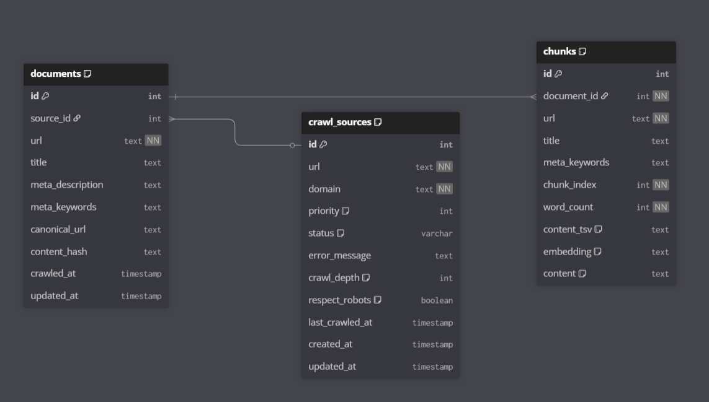

# Crawler Engine

```
crawler/
├── src/
│   ├── config/seeds.ts          → 22 curated Web3 sources (3 priority tiers)
│   ├── db/
│   │   ├── schema.ts            → Drizzle schema (3 tables, custom vector/tsvector types)
│   │   ├── client.ts            → Pool (max 20, 30s idle timeout)
│   │   └── migrations/
│   │       └── 0001_...sql      → Extensions + trigger + all 3 search indexes
│   ├── pipeline/
│   │   ├── fetcher.ts           → Retry (3x, exp backoff) + robots.txt cache
│   │   ├── extractor.ts         → Cheerio noise stripping + link discovery
│   │   ├── chunker.ts           → 300-500w sentence-aligned + 2-sentence overlap
│   │   └── indexer.ts           → Transactional upsert + hash-based skip
│   ├── crawler.ts               → PQueue global(10) + per-domain(2, 1.5s)
│   └── index.ts                 → Entry + graceful SIGTERM drain
```

# Schema


# Hybrid Search - Reciprocal Rank Fusion

```
   Search Architecture — Three-Strategy Hybrid:
   ┌────────────────────────────────────────────────────────────────────────┐
   │  Strategy 1: Lexical   → content_tsv (Text-Search-vector) + GIN index  │
   │  Strategy 2: Semantic  → embedding (vector)    + HNSW index            │
   │  Strategy 3: Fuzzy     → content (text)        + GIN trigram index     │
   └────────────────────────────────────────────────────────────────────────┘
```

### 1. Lexical Search (The "Keyword" Engine)
*   **Technology**: PostgreSQL `tsvector` + GIN Index.
*   **Strength**: High precision for exact technical terms (e.g., "ERC-20", "Solidity", "EIP-1559").
*   **How it works**: It breaks text into tokens and "stems" them (e.g., "crawling" becomes "crawl"). It understands the grammar of the document.

### 2. Semantic Search (The "Brain")
*   **Technology**: `pgvector` + HNSW (Hierarchical Navigable Small World) Index.
*   **Strength**: Understands intent and synonyms.
*   **How it works**: Converts text into dense 1536-dimension vectors. It can find a result for "How to move funds" even if the document only mentions "ETH transfer" because the *meaning* is similar.

### 3. Fuzzy Search (The "Safety Net")
*   **Technology**: `pg_trgm` (Trigrams) + GIN Index.
*   **Strength**: Typo tolerance and partial matching.
*   **How it works**: Breaks words into 3-character chunks. If a user types "Ethreum" (typo), the trigram index will still match it to "Ethereum" with high similarity.

###  Why Hybrid?
Pure vector search can sometimes be "vague," and pure keyword search is too "rigid." By combining all three using **Reciprocal Rank Fusion (RRF)**, we get the best of all worlds:
- **Speed** of Lexical.
- **Intelligence** of Semantic.
- **Resilience** of Fuzzy.

> [!NOTE]
> All indexes are intentionally defined in the raw SQL migrations to ensure maximum performance and native PostgreSQL features that ORMs sometimes abstract away.
  
   Drizzle ORM cannot express HNSW WITH parameters, tsvector GENERATED
   ALWAYS AS columns, or trigram-specific GIN operator classes natively.
   The raw migration is the source of truth for those constructs.


# Pipeline Flow

#### Crawler Flow
```
1. Crawl page
2. Store in documents
3. Split into chunks
4. Insert into chunks table
5. Trigger generates tsvector
6. Background worker generates embedding
7. Indexes make it searchable
```

#### Fetcher Flow
```
1. Retry (3x, exp backoff)
2. robots.txt cache
```

#### Extractor Flow
```
1. Raw HTML
2. Strip all noise elements
3. MetaData extraction (title,keywords,description,canonical url)
4. Extract high-signal content  (article, main, .markdown-body)
5. Fall back to <body> if no specific high-signal-container matches
6. Normalise whitespace for clean chunk input
7. Collect internal links for crawl queue expansion
8. With the help of links,crawler aage badta hai
```

#### Chunker Flow
```
1. Split text into sentences
2. Group sentences into chunks of 300–500 words
3. Maintain 1–2 sentence overlap between adjacent chunks
4. Flush at paragraph boundaries when near target word count
5. Discard trailing fragments under 50 words
```

#### Indexer Flow
```
1. Atomically upsert a `crawled document` into PostgreSQL
2. Insert new chunks in a single bulk INSERT
3. Delete old chunks for this document (re-crawl scenario)
4. If page body hasn't changed since last crawl (same hash), skip chunk deletion and re-insertion
5. content_tsv (Content TsVector) is NOT set here — it's populated by the DB trigger `trg_chunks_tsv_update` on INSERT
6. Chunks with NULL embeddings are excluded from the HNSW partial index
```

## Normal DB index + GIN + HNSW


## DB Triggers

