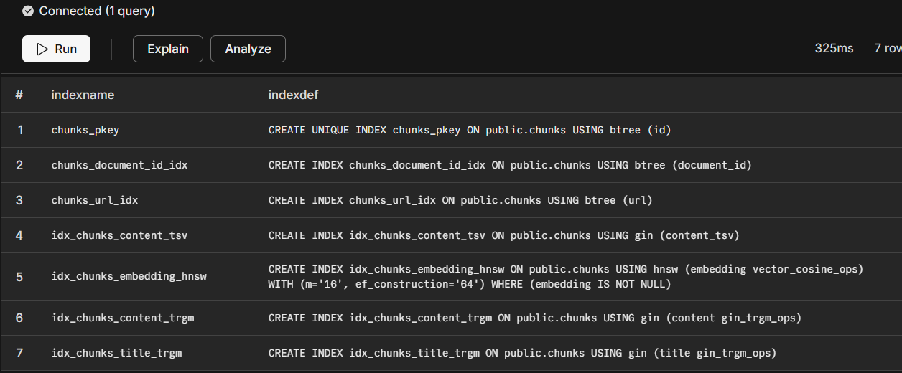
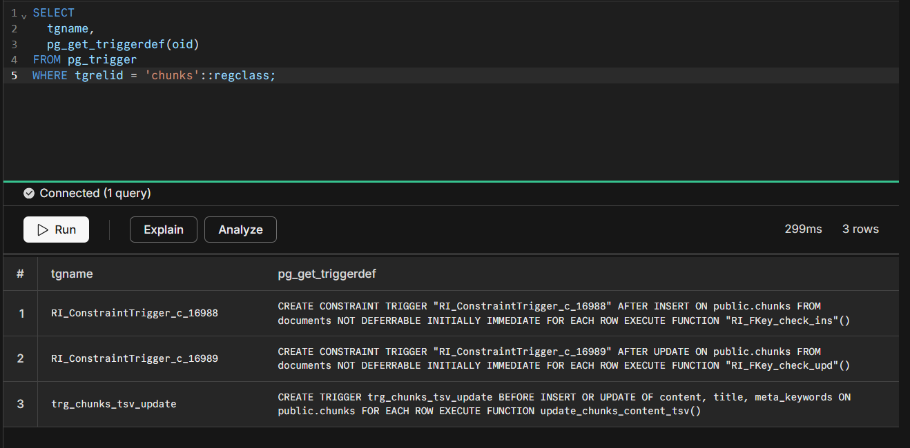

# Web3 Crawler

```
crawler/
├── src/
│   ├── config/seeds.ts          → 22 curated Web3 sources (3 priority tiers)
│   ├── db/
│   │   ├── schema.ts            → Drizzle schema (3 tables, custom vector/tsvector types)
│   │   ├── client.ts            → Pool (max 20, 30s idle timeout)
│   │   └── migrations/
│   │       └── 0001_...sql      → Extensions + trigger + all 3 search indexes
│   ├── pipeline/
│   │   ├── fetcher.ts           → Retry (3x, exp backoff) + robots.txt cache
│   │   ├── extractor.ts         → Cheerio noise stripping + link discovery
│   │   ├── chunker.ts           → 300-500w sentence-aligned + 2-sentence overlap
│   │   └── indexer.ts           → Transactional upsert + hash-based skip
│   ├── crawler.ts               → PQueue global(10) + per-domain(2, 1.5s)
│   └── index.ts                 → Entry + graceful SIGTERM drain
```

# Schema

```
   Search Architecture — Three-Strategy Hybrid:
   ┌─────────────────────────────────────────────────────────────────┐
   │  Strategy 1: Lexical   → content_tsv (tsvector) + GIN index    │
   │  Strategy 2: Semantic  → embedding (vector)    + HNSW index    │
   │  Strategy 3: Fuzzy     → content (text)        + GIN trgm idx  │
   └─────────────────────────────────────────────────────────────────┘
  
   NOTE: GIN (tsvector), HNSW (vector), and GIN (trgm) indexes are
   intentionally defined in the raw SQL migration:
  
   Drizzle ORM cannot express HNSW WITH parameters, tsvector GENERATED
   ALWAYS AS columns, or trigram-specific GIN operator classes natively.
   The raw migration is the source of truth for those constructs.
```

# Pipeline Flow

#### Crawler Flow
```
1. Crawl page
2. Store in documents
3. Split into chunks
4. Insert into chunks table
5. Trigger generates tsvector
6. Background worker generates embedding
7. Indexes make it searchable
```

#### Fetcher Flow
```
1. Retry (3x, exp backoff)
2. robots.txt cache
```

#### Extractor Flow
```
1. Raw HTML
2. Strip all noise elements
3. MetaData extraction (title,keywords,description,canonical url)
4. Extract high-signal content  (article, main, .markdown-body)
5. Fall back to <body> if no specific high-signal-container matches
6. Normalise whitespace for clean chunk input
7. Collect internal links for crawl queue expansion
8. With the help of links,crawler aage badta hai
```

#### Chunker Flow
```
1. Split text into sentences
2. Group sentences into chunks of 300–500 words
3. Maintain 1–2 sentence overlap between adjacent chunks
4. Flush at paragraph boundaries when near target word count
5. Discard trailing fragments under 50 words
```

## Normal DB index + GIN + HNSW


## DB Triggers

